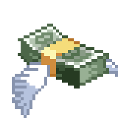

# Hi, I’m Roshan Prabhu   
 (aka @Powahm)

 

I am a first year undergraduate at the University of Sheffield. A budding Software Engineer with his interests in AI and Robotics. Reason? I'm lazy and I want someone to do the work for me. Humans need money  , but... AI is free if you build it 

- 👀 I’m interested in Computer Vision, UI/UX Design  
- 🌱 I’m currently learning YOLO algorithm & Java
- 💞️ I’m looking to collaborate on python projects, game dev, UI/UX building, anything really just hmu
- ⚡ Also experienced in: notion, upbase, project management, webhooks (a bit)

### > My Tech Stack  

### > Miscellaneous

### > Some Interesting Projects  

### > Let's Collaborate  

### > Fun Fact  
I am also a photographer - check out my work 

